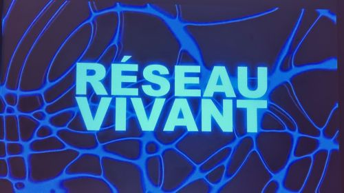
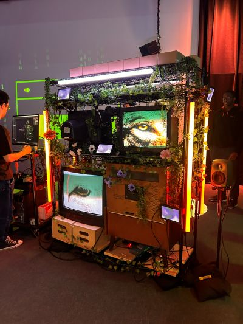
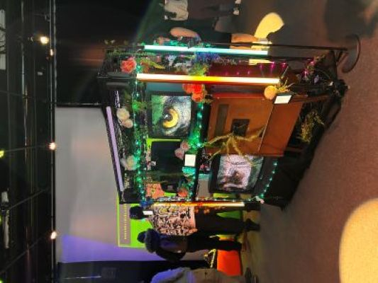
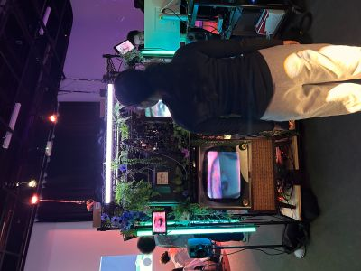
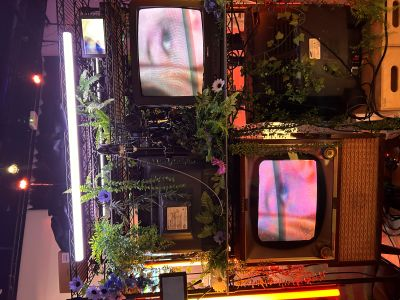

# Exposition Finissants
## Studio TIM Finissants

> Exposition Finissants 24 février 2026

## Quand les yeux se croisent
### Edelwyn Ledru, Félix Lavoie, Jade Hébert, Manel Yaya, Patricia Nassif

 

> Quand les yeux se croisent Exposition Finissants 24 février 2026 Photo: Zara Lanthier

- Installation contemplative et interactive du 16 au 20 mars 2026 au studio des finissants TIM Montmorency;
- Oeuvre de Edelwyn Ledru, Félix Lavoie, Jade Hébert, Manel Yaya et Patricia Nassif réalisé au cours de l'année 2025;
- Les artistes essayent de créer une expérience entre les animaux et l'humain pour représenter le lien universel qui nous rassemble. Au travers des regards, l'utilisateur est invité à observer le regards animal projetés ainsi qui le sien créant un dialogue visuel.
  L'oeuvre tente d'établir un lien profond entre l'Homme et l'Animal;

- En circulant autour du dispositif, on remarque les regards de animaux, mais ce n'est que lorsque l'on entre dans un zone mise en valeur par un cercle de lumière que l'intéraction s'active. Nos yeux sont projetés dans les divers écrans. L'ambiance sonore s'intensifie et on entend divers bruits nous plongeants dans une atmosphère mélancolique;
- Lors de l'expérience, je me suis senti plongé dans un décor calme et naturel. Le contraste entre les yeux d'animaux ainsi que nos yeux créé une ambiance mystérieuse où on ne fait qu'un avec le décor. Les plantes ajoutent un côté sensible à l'exposition;
> ''Ce jeu d’échanges visuels instaure un dialogue silencieux qui brouille la frontière entre celui qui observe et celui qui est observé.''
> - -[Dossier de conception fait par l'équipe](https://emersiaa.github.io/Quand-les-yeux-se-croisent/#/concept/?id=lexp%c3%a9rience>)

> Quand les yeux se croisent Exposition Finissants 24 février 2026 Photo: Zara Lanthier

- La direction artistique est très intéressante. Les images d'inspirations sont recherchées et concorde avec le résultat final. Je trouve que l'expérience est très divertissante et on ressent vraiment la profondeur du lien entre humains et animaux;
- Je trouve que le parcours est assé court et aurait pu être complexifié. On aurait pu cacher le cablage et l'arrière des télévisions pour rendre le résultat plus propre;
