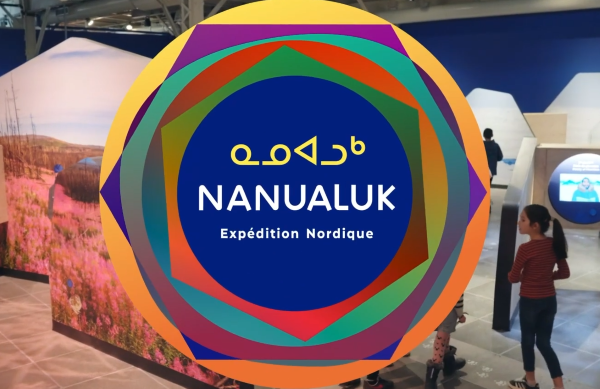
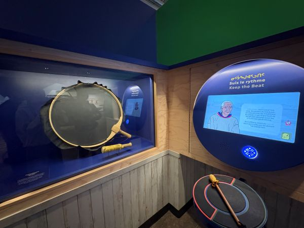
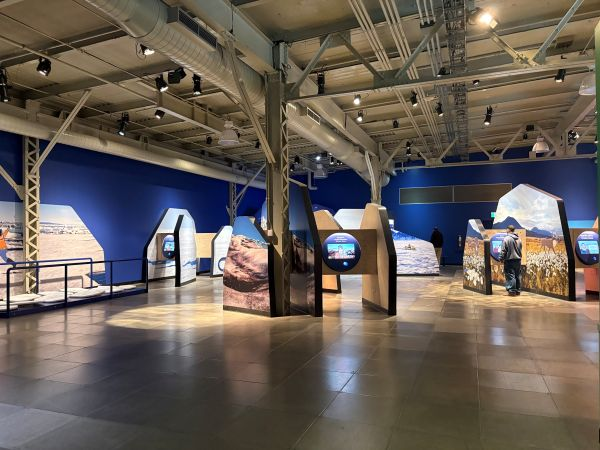
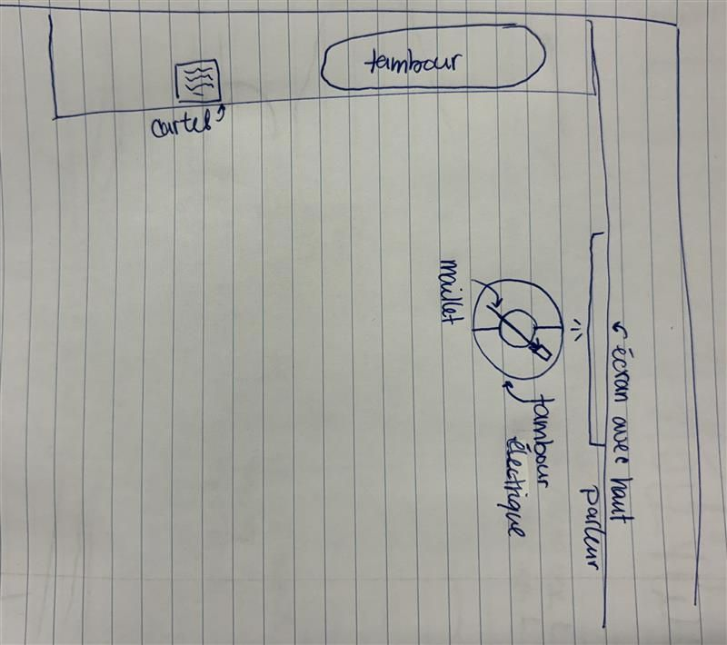
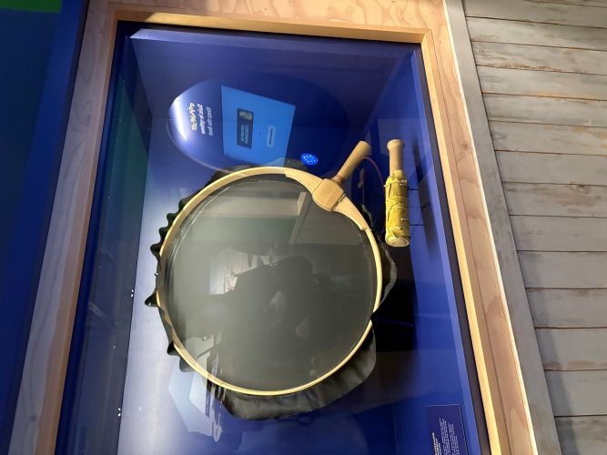
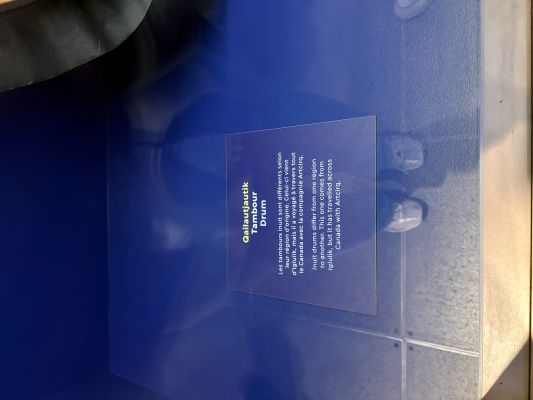
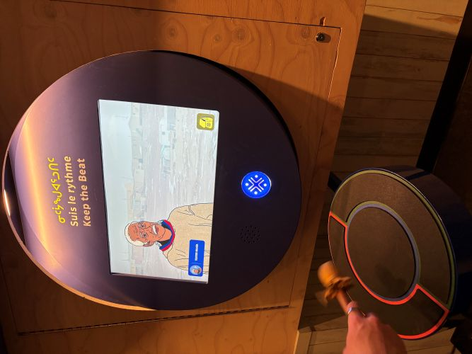
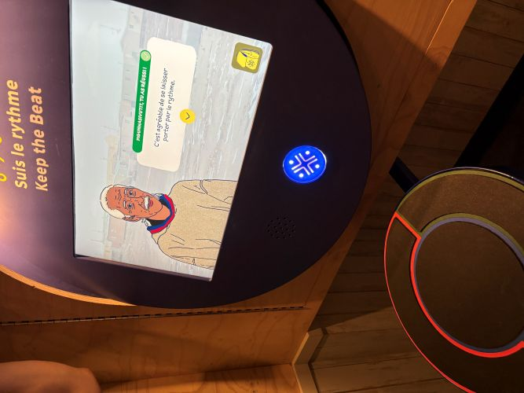
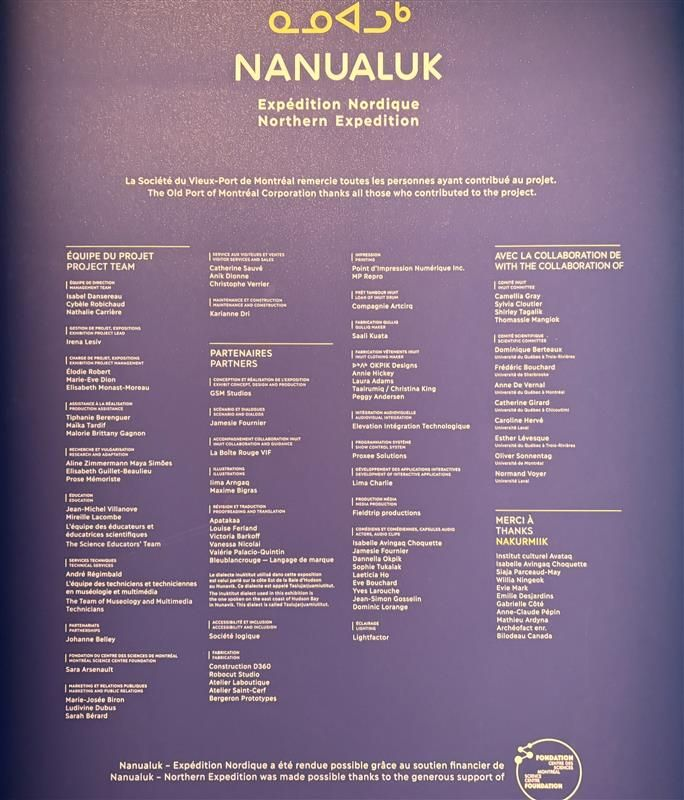

# Nanualuk – Expédition Nordique
## Centre des sciences de montréal 

> Affiche Nanualuk – Expédition Nordique Photo: [vidéo promotionnelle sur le site du centre des sciences](https://www.centredessciencesdemontreal.com/exposition-permanente/nanualuk-expedition-nordique)

### Suis le rythme
#### Fondation centre des sciences Montréal

> Nanualuk – Expédition Nordique Suis le rythme 2 avril 2026 Photo: Zara Lanthier

- Exposition permanante ouverte dès le 1er mars 2025, financée par la Fondation centre des sciences montréal et réalisée au cours de l'année 2025 (visité le 2 avril avril 2026);
  
- Installation interactive: L'utilisateur est invité a prendre le maillet et à l'utiliser sur le tambour pour suivre le rythme indiqué sur l'écran mis a disposition. Des explications sur la musique et la culture Inuit sont distribuées où l'utilisateur peut intéragir avec le contenu. Lorsque le jeux est complété, l'utilisateur récupère un badge enregistré dans son sac à dos. Il peut scanner son médaillon à la fin du parcours pour voir ce qu'il a accumulé dans son sac à dos. Chaque activité terminé donne un badge à l'utilisateur;

> Nanualuk – Expédition Nordique Suis le rythme 2 avril 2026 Photo: Zara Lanthier

> Nanualuk – Expédition Nordique Suis le rythme mise en espace Photo: Zara Lanthier

- La salle met a disposition plein de petits kiosque sur la culture Inuit. Un kiosque présente la culture musical du peuple à travers un jeux: Sur un mur, un écran est mis a disposition pour distribuer les explications du jeux et sur les traditions Inuit. L'utilisateur scanne un médaillon (nanuup tuminnga) préalablement acquis a l'entré de l'exposition pour démarrer l'activité. Le maillet permet de jouer le tambour électrique divisé en trois section (droite, gauche et milieu) pour suivre le rythme. Sur le mur adjacent, on présente un véritable tambour inuit avec une courte description;

 
> Tambour Inuit Nanualuk – Expédition Nordique Suis le rythme 2 avril 2026 Photo: Zara Lanthier

- Composantes et techniques : écran, haut parleur, tambour électrique, maillet;
- Éléments nécessaires à la mise en exposition: Tambours inuit;

  
>Nanualuk – Expédition Nordique Suis le rythme 2 avril 2026 Photo: Zara Lanthier

  
- L'expérience est très divertissante: le contenu sur les traditions inuit est très intéressant et le jeux s'exécute de manière très fluide. C'est une activité qui fonctionne bien et qui accroche le publique;

- J'ai aimé le format du jeux: le concept est cohérent avec l'exposition entière et l'activité est très agréable pour un publique plus jeune. Les portions d'explications sont très bien distribués et facile à comprendre. J'ai aimé les personnages qui présentait l'activité. On présente vraiment des figures typiques Inuit et on voit le contrsate avec notre société ce qui nous permet de se projeté dans un paysage nordique. l'esthétique de l'exposition est visuellement agréable et très bien maintenu;
  
- Dépendant des activités, lorsqu'on doit sortir du kiosque pour exécuter l'activité, on doit revenir à ce même kiosque pour la terminer. Cependant, si d'autres utilisateurs s'y sont installé pendant ce temps, l'attente peut être désagréable et longue.
  
- Références: [centre des sciences de montréal](https://www.centredessciencesdemontreal.com/exposition-permanente/nanualuk-expedition-nordique), [La Presse](https://www.lapresse.ca/arts/arts-visuels/2025-03-05/nanualuk/expedition-nordique-au-centre-des-sciences.php), [Communiqué de presse Nanaluk - Expédition Nordique](https://www.centredessciencesdemontreal.com/sites/default/files/inline-files/cp-nanualuk_final_final-s.pdf)

> Crédits des personnes ayant contribué au projet Nanualuk – Expédition Nordique
