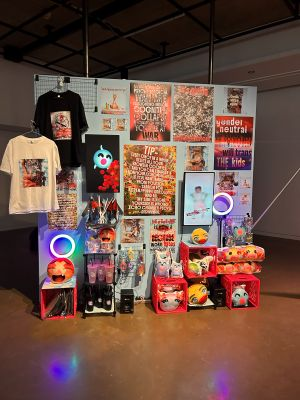

# Devenir partager, pratique de l'IA
## Galerie d'Art Université de montréal
### *Slop Psyop Realism (plea$e subscribe)*
#### Francisco Gonzalez-Rosas

 
 > *Slop psyop realism* Francisco Gonzalez Galerie UdeM 29 janvier

- Exposition temporaire du 28 novembre au 28 février qui à été présenté par la galerie d'Art de l'université de montréal;
- Oeuvre contemplative de Francisco Gonzalez-Rosas, *Slop Psyop Realism (plea$e subscribe)* réalisé au cours de l'année 2025 visité le 29 janvier 2026;
- L'artiste représente un univers peuplé ainsi qu'un paysage saturé pour critiquer la culture post-Internet. Francisco utilise l'intelligence
   artificielle pour générer des affiches absurdes, des symboles typiques de l'internet et des vidéos strobostopiques rapellant le contenus
    et les opinions des internautes. Il critique notre consommation de l'internet ainsi que du contenu devenu marchandisé pour les auditeurs à la recherche de perpétuel satisfaction;

 
 > Cartel de l'oeuvre

- Sur un mur, des contenus et de la musique en accord sont diffusé grâce à des haut parleur et des écrans. Une vidéo est joué à l'arrière du mur et des poufs sont aménageés pour apprécié l'expérience. De plus, des écouteurs sont à dispositions pour écouter l'audio de la vidéo

> Aménagement de l'espace pour une video

- 
