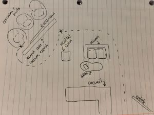
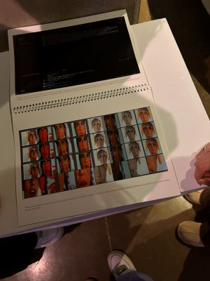
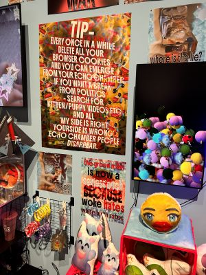
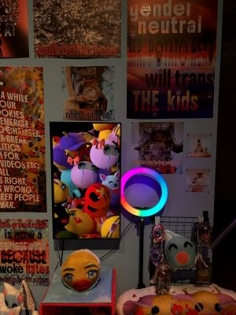

# Devenir partager, pratique de l'IA
## Galerie d'Art Université de montréal
### *Slop Psyop Realism (plea$e subscribe)*
#### Francisco Gonzalez-Rosas

 
 > *Slop psyop realism* Francisco Gonzalez Galerie UdeM 29 janvier

- Exposition temporaire du 28 novembre 2025 au 28 février 2026 qui à été présenté par la galerie d'Art de l'université de montréal;
- Oeuvre contemplative de Francisco Gonzalez-Rosas, *Slop Psyop Realism (plea$e subscribe)* réalisé au cours de l'année 2025 visité le 29 janvier 2026;
- L'artiste représente un univers peuplé ainsi qu'un paysage saturé pour critiquer la culture post-Internet. Francisco utilise l'intelligence
   artificielle pour générer des affiches absurdes, des symboles typiques de l'internet et des vidéos strobostopiques rapellant le contenus
    et les opinions des internautes. Il critique notre consommation de l'internet ainsi que du contenu devenu marchandisé pour les auditeurs à la recherche de perpétuel satisfaction;
  [Projets de Francisco Gonzalez-Rosas](https://www.franciscogonzalezrosas.com/)

 
 > Cartel de l'oeuvre

- Sur un muret, des contenus et de la musique en accord sont diffusé grâce à des haut parleur et des écrans. Une vidéo est joué à l'arrière du mur et des poufs sont aménageés pour apprécié l'expérience. De plus, des écouteurs sont à dispositions pour écouter l'audio de la vidéo;

> Aménagement de l'espace pour une video

 
 > utilisation de l'espace

-  Un muret est aménagé pour exposer chaque composante de l'oeuvre. un bloc à été mis à disposition de présenter un livre expliquant le processus créatif ainsi que les démarches de l'Artiste. De la marchandise en lien avec l'oeuvre est également vendu et l'argent accumulé est distribué à un organisme;

    
> Livre sur le processus de l'oeuvre

- L'artiste veut submerger les auditeurs d'informations impertinantes et de contenus médiocre. Il réussit avec succès à captiver le publique ce qui me semble troublant.
  En tant que spectateurs, nous sommes attirés et curieux, toujours dans l'attente et l'excitation de ce qui va se passer ensuite ce qui définit exactement l'ogbjectif de l'oeuvre.
  C'est cette fascination et toute la réflexion au travers qui m'interesse. On se pose vraiment la question de notre impact et de notre consommation tant qu'à l'internet. Cependant,
  si ce projet avait à être modifié, j'aurais mis en accord tous les extraits audio: le son du devant du mur aurait pu être synchronisé avec l'arrière du même mur pour rendre la compréhension des deux éléments indépendants plus naturelle.

  
>*Slop psyop realism* Francisco Gonzalez Galerie UdeM 29 janvier

- photos et informations récoltés par Zara Lanthier
