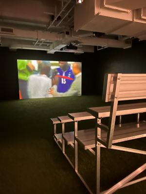
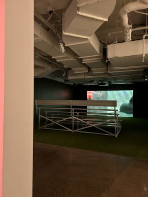
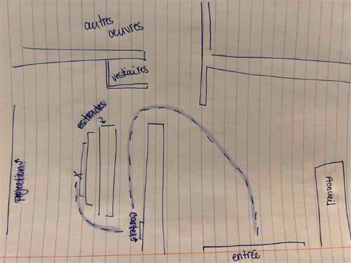
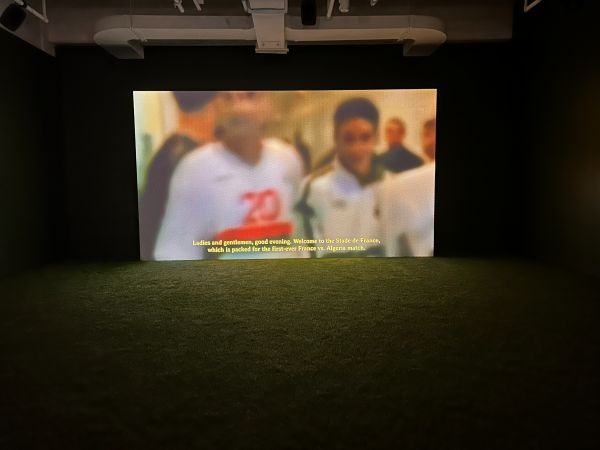

# L'éloge de l'image manquante
## Musée d'Art Contemporain de montréal

>L'éloge de l'image manquante Musée d'Art Contemporain affiche promotionelle Photo : [Site du musée d'art contemporain de mtl](https://macm.org/expositions/momenta-eloges/)

## Bêtise Humaine
### Joyce Joumaa

> Bêtise Humaine Joyce Joumaa L'éloge de l'image manquante 21 février 2026
> Photo: Zara Lanthier

- Exposition temporaire du 11 septembre 2025 au 8 mars 2026 qui à été présenté par le Musée d'Art Contemporain de montréal;
- Oeuvre contemplative de Joyce Joumaa coproduite grâce à un partenariat entre MOMENTA et Vidéographe, *Bêtise Humaine* réalisé au cours de l'année 2025 visité le 21 février 2026;
- L'artiste illustre les conséquences d'un passé colonial sur une nation et critiques les abus de pouvoirs sur une population. Joyce représente une scène de réconciliation évoquant la nostalgie d'une époque révolue.
  [Projets de Joyce Joumaa](https://joycejoumaa.com/);

> Cartel Bêtise Humaine
> Photo: Zara Lanthier

- Composantes techniques:  Une estrade est aménagé pour regarder la vidéo et du gazon artificiel est placé au sol, rapellant une ambiance de terrain  de soccer. Une installation vidéo à canal unique de 14 minutes 30 secondes en couleur avec du son joue en boucle. Des haut-parleurs situés au plafond permettent d'entendre l'audio de la vidéo;

- Éléments nécessaires à la mise en exposition: Sur un mur, une grande toile permet de diffuser l'oeuvre grâce à un projecteur. Le cartel est placé sur un mur derrière les estrades;

   

> Mise en espace Bêtise Humaine
> Photo: Zara Lanthier

- Un court métrage joue en boucle pour que l'utilisateur s'installe dans une estrade rappelant les terrains de jeux sportifs. La cartel peux être lue en premier est affichée sur un mur en arrière de l'estrade.
La vidéo présente un match de soccer amical opposant la France et l'Algérie en 2001, anciens pays colonisateur, ainsi que des extraits du film *The Battle of Algiers* 1966, qui parle de la guerre d'indépendance
de l'Algérie;

- La recherche d'images et de thèmes pour le projet est très intéressante. Les relations de pouvoir sont abordées de manière judicieuse et on comprend très bien l'essence du projet. Le court-métrage est touchant et mélancolique. On ressent la soif de justice et de réconciliation;

- Les estrades ne sont pas très comfortable considérant que le court métrage dure 14 minutes et 30 secondes. L'utilisateur peut être tenté à passer à la prochaine oeuvre très rapidement sans s'intéresser entièrement au sujet de *Bêtise humaine*;
>''Sous le thème Éloges de l’image manquante, la Biennale 2025 interroge aussi bien les enjeux contemporains de l’image que les conséquences actuelles des dynamiques complexes de construction des récits. Quelles histoires sont racontées, comment le sont-elles et par qui ?­­'' 
>-[MOMENTA 2025](https://centrevox.ca/expositions/momenta-2025)

> Bêtise Humaine Joyce Joumaa L'éloge de l'image manquante 21 février 2026
> Photo: Zara Lanthier

-Références: 
[MOMENTA Biennale d'Art Contemporain](https://momentabiennale.com/)
[Journal Place Ville Marie](https://placevillemarie.com/fr/evenements/exposition-au-mac-eloges-de-limage-manquante)
[MOMENTA x VOX](https://centrevox.ca/expositions/momenta-2025)
[Joyce Joumaa](https://joycejoumaa.com/)
[Musée d'Art Contemporain de Montméral](https://macm.org/expositions/momenta-eloges/)

