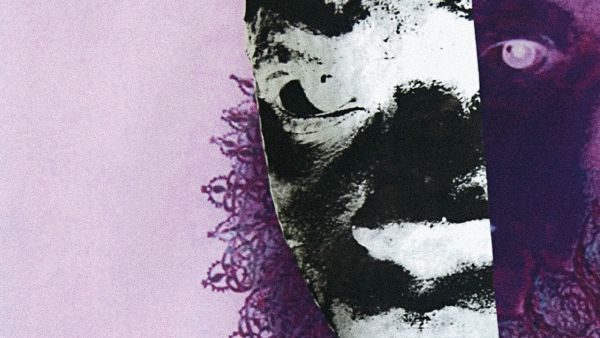
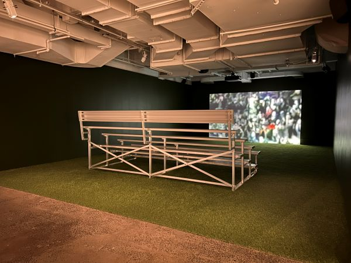
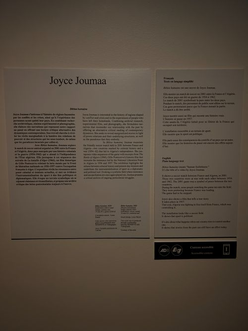

# L'éloge de l'image manquante
## Musée d'Art Contemporain de montréal

>L'éloge de l'image manquante Musée d'Art Contemporain

## Bêtise Humaine
### Joyce Joumaa

> Bêtise Humaine Joyce Joumaa L'éloge de l'image manquante 21 février 2026

- Exposition temporaire du 11 septembre 2025 au 8 mars 2026 qui à été présenté par le Musée d'Art Contemporain de montréal;
  [Musée d'Art Contemporain de montréal](https://macm.org/expositions/momenta-eloges/)
- Oeuvre contemplative de Joyce Joumaa, *Bêtise Humaine* réalisé au cours de l'année 2025 visité le 21 février 2026;
- L'artiste illustre les conséquences d'un passé colonial sur une nation et critiques les abus de pouvoirs sur une population. Joyce représente une scène de réconciliation évoquant la nostalgie d'une époque révolue 
  [Projets de Joyce Joumaa](https://joycejoumaa.com/)

  

