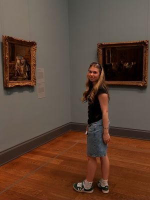
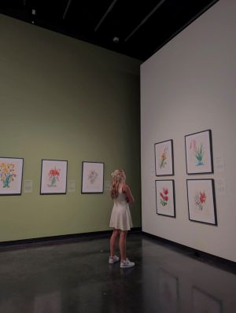
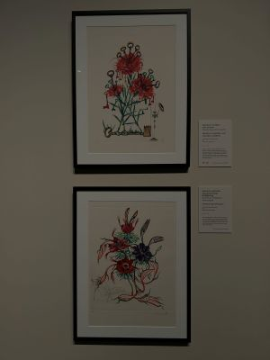

# Portrait
## Zara Lanthier
### Intérêt dans le multimédia
J'ai un intérêt notamment pour les manières de diffusion de l'art. Toutes les avancées technologiques pour transmettre l'art et la manière d'interaction avec le publique me fascine. De nos jours, la manière que nous consommons l'art à, évidemment, beaucoup évolué et c'est cette évolution que je trouve interressante. L'art est tout autours de nous et fait parti de notre quotidien, cependant tout le monde y réagis différement considérant la manière qu'il est transmis. 

 
 > Musée MET New York mai 2025
[Metropolitain Musueum of Art](https://www.metmuseum.org/)

### Exposition inspirante
Une exposition qui m'a beaucoup inspiré était celle de Salvador Dali en Floride. J'ai pu visiter les installations de musée de St Petersburg en juillet 2024 en hommage à ce grand artiste ainsi qu'à toutes ses créations. Dali était un visionnaire: il a imaginé plein de projets et créé de multiples tableaux en utilisant des symboles remarquables. Les fourmis représentaientt la mort, tandisqu'une horloge liquéfié lui rappelait le temps qui passe. De plus, j'ai pu analyser son processus créatif innovant. L'artiste s'inspirait de natures mortes pour créer des compositions incluants des personnages imaginaires ainsi que des bestioles uniques créant une armonie créative. Il a sû utiliser ses symboles qui sont aujourd'hui reconnus de tous. Cet artiste m'inspire à observer les détails et à comprendre les techniques artistiques dans de futurs projets.

   
>Exposition Salvador Dali Musée de St Petersburg juillet 2024

